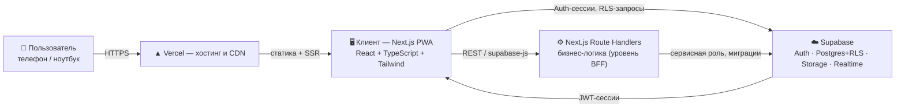
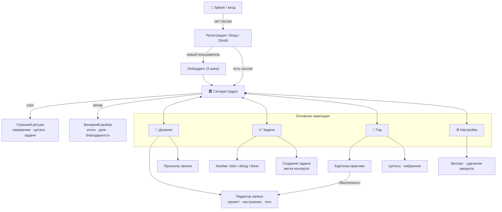
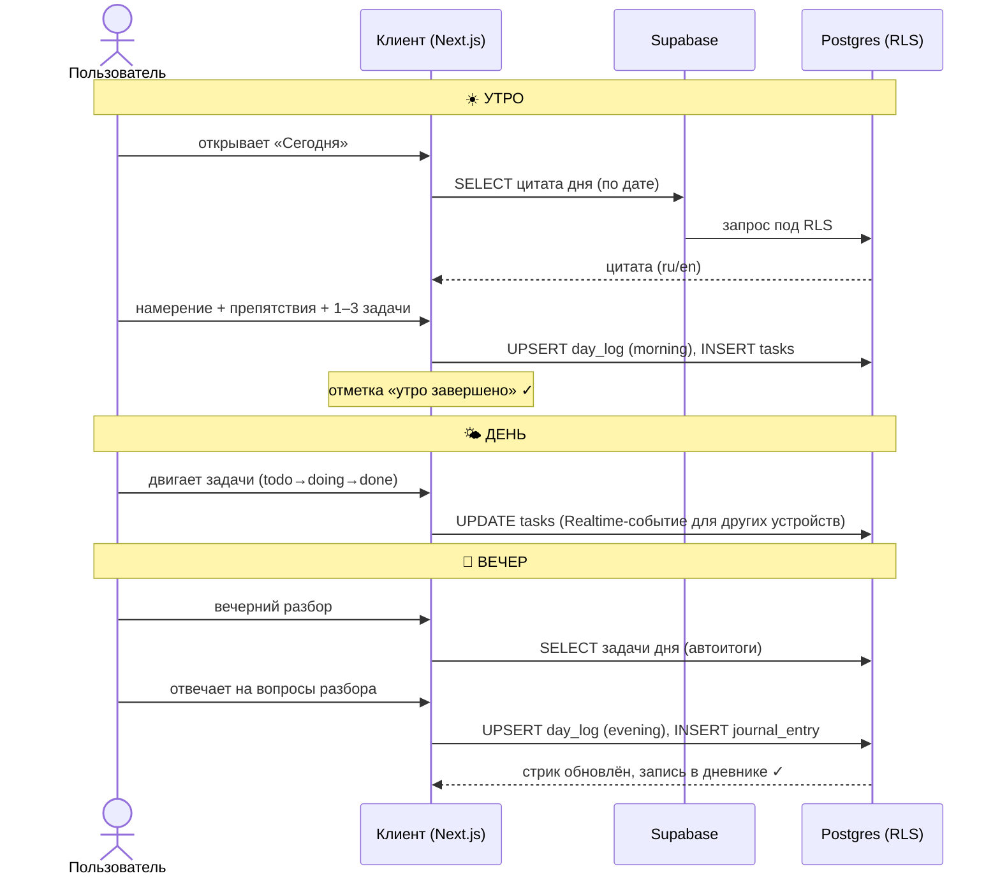
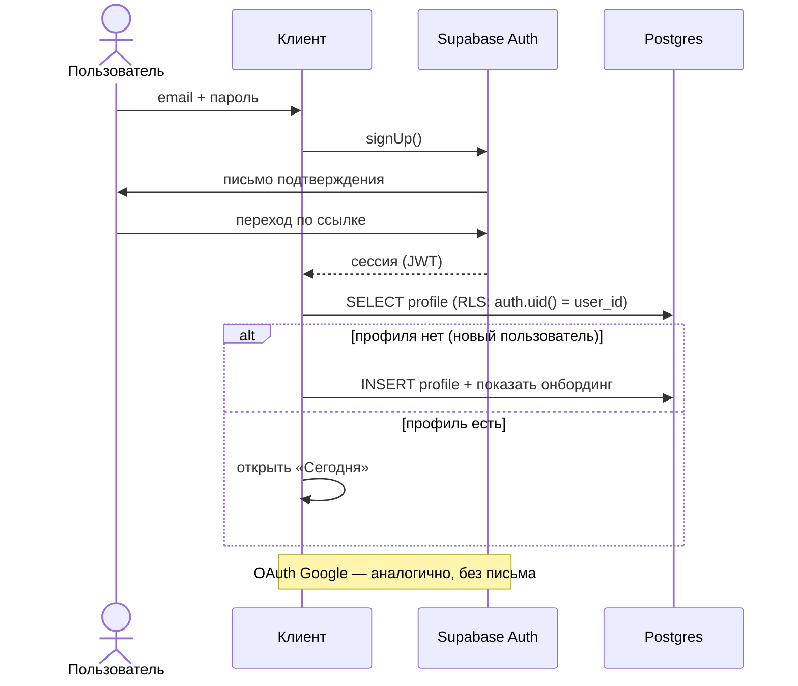
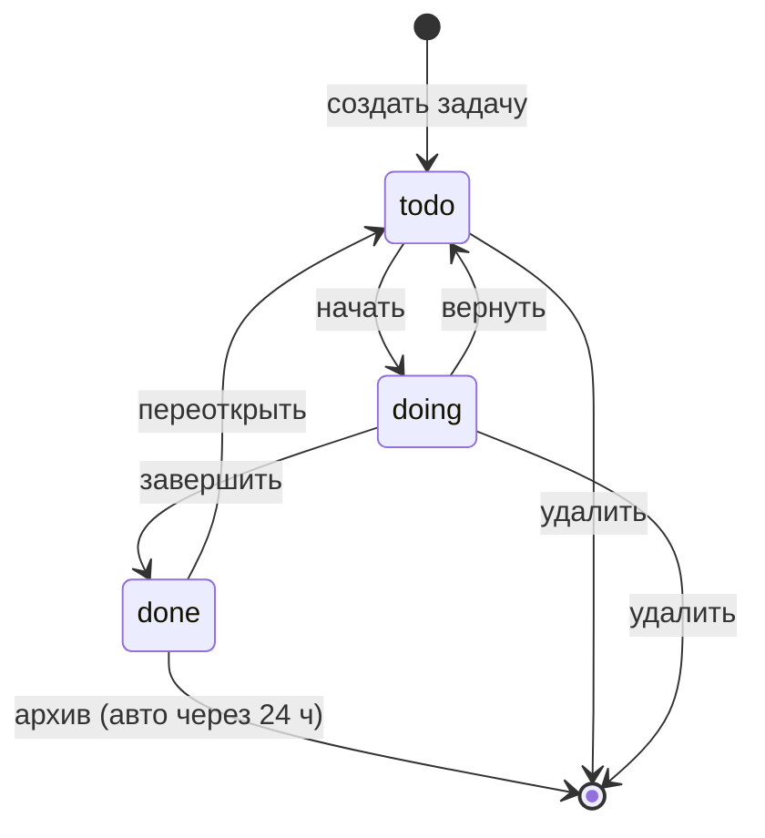
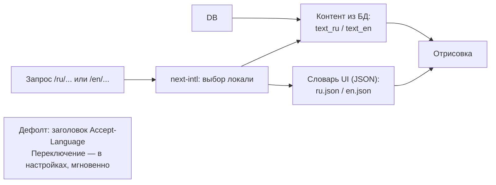
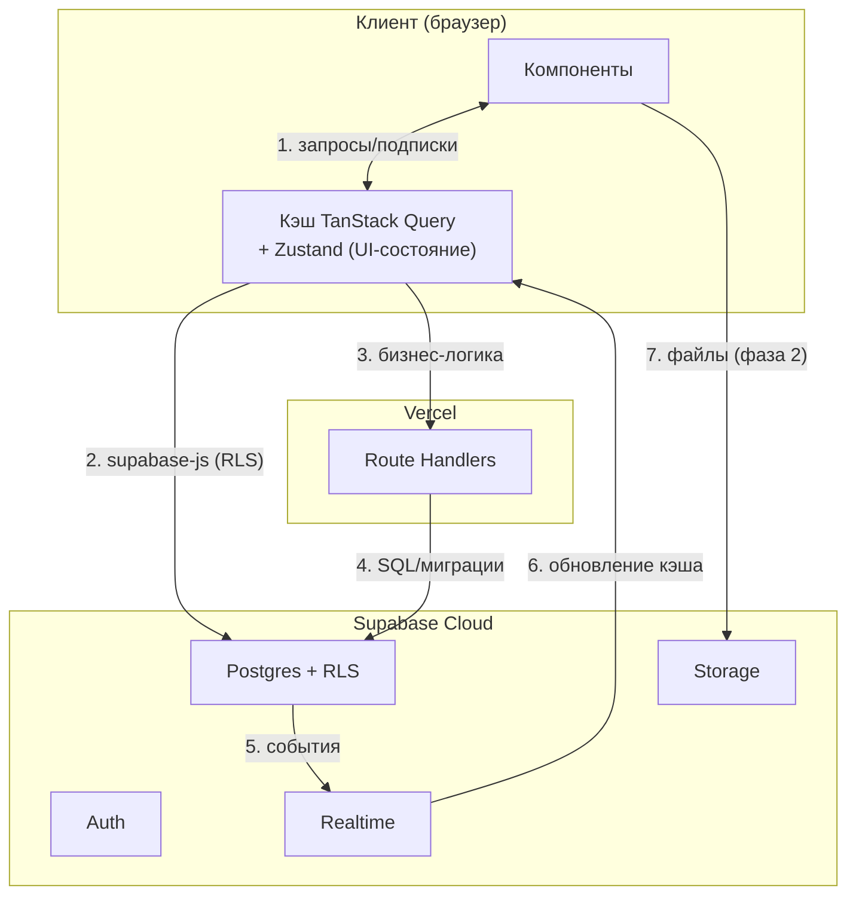

# 03. Архитектура: блок-схемы и потоки

> Диаграммы в формате Mermaid (GitHub отображает их встроенно). Всё спроектировано под бесплатные тиры Supabase + Vercel.

## 1. Контекстная диаграмма системы



**Принцип безопасности:** чувствительные данные (дневник, задачи) читаются/пишутся напрямую через Supabase с Row Level Security — сервер-посредник не может «случайно» отдать чужие данные. Бизнес-логика (ротация цитат, недельная сводка, экспорт) — в Route Handlers.

## 2. Схема модулей и навигации приложения



## 3. Главный поток: «цикл дня»



## 4. Поток авторизации



## 5. Модель данных (ER-диаграмма)

```mermaid
erDiagram
    PROFILES ||--o{ JOURNAL_ENTRIES : "пишет"
    PROFILES ||--o{ TASKS : "ведёт"
    PROFILES ||--o{ DAY_LOGS : "по дням"
    PROFILES ||--o{ FAVORITE_QUOTES : "избранное"
    PROFILES ||--o{ PRACTICE_LOGS : "выполняет"

    PROFILES {
        uuid id PK "auth.uid()"
        text name
        text lang "ru|en"
        text theme "light|dark|system"
        text timezone
        time morning_reminder
        time evening_reminder
    }

    JOURNAL_ENTRIES {
        uuid id PK
        uuid user_id FK
        text type "morning|evening|free|practice"
        text content
        smallint mood "1..5"
        text tags
        uuid practice_id FK "опц."
        timestamptz created_at
        timestamptz updated_at
    }

    TASKS {
        uuid id PK
        uuid user_id FK
        text title
        text note
        text status "todo|doing|done"
        text priority "P1|P2|P3"
        text control "in_control|external"
        text reaction "как отвечу (для external)"
        date due_date
        text recur "daily|weekly|none"
        timestamptz completed_at
    }

    DAY_LOGS {
        uuid id PK
        uuid user_id FK
        date day
        text intention
        text obstacles
        text lesson
        text gratitude
        boolean morning_done
        boolean evening_done
        unique(user_id, day)
    }

    QUOTES {
        uuid id PK
        text author
        text text_ru
        text text_en
        text source
        text tags
    }

    PRACTICES {
        uuid id PK
        text slug
        text title_ru
        text title_en
        text summary_ru
        text summary_en
        jsonb steps_ru
        jsonb steps_en
        text category
        text duration
    }

    PRACTICE_LOGS {
        uuid id PK
        uuid user_id FK
        uuid practice_id FK
        date day
    }

    FAVORITE_QUOTES {
        uuid user_id FK
        uuid quote_id FK
        unique(user_id, quote_id)
    }
```

**RLS-политики (ядро безопасности):**
- `JOURNAL_ENTRIES`, `TASKS`, `DAY_LOGS`, `PRACTICE_LOGS`, `FAVORITE_QUOTES`: `user_id = auth.uid()` на SELECT/INSERT/UPDATE/DELETE — пользователь видит только свои данные;
- `QUOTES`, `PRACTICES` — публичное чтение (это общий контент), запись — только сервисной ролью (seed-скрипты);
- `PROFILES`: чтение/запись только своего профиля.

## 6. Диаграмма состояний задачи



## 7. Схема i18n



## 8. Поток данных (data flow, упрощённо)



## 9. Структура репозитория (фактическая, v0.1)

```
stoa/
├── web/                    # Next.js-приложение (App Router)
│   ├── src/
│   │   ├── app/
│   │   │   ├── [locale]/   # страницы: (login, onboarding, today, journal, tasks, guide, settings)
│   │   │   ├── api/        # Route Handlers (/api/health)
│   │   │   └── globals.css # дизайн-токены (2 темы)
│   │   ├── components/     # Shell (навигация), ui-примитивы
│   │   ├── i18n/           # next-intl: routing, navigation, request
│   │   ├── lib/            # store (адаптер данных), quotes, practices, prompts, streak, types
│   │   ├── messages/       # ru.json, en.json
│   │   └── middleware.ts   # локаль-роутинг
│   ├── tests/              # vitest: бизнес-логика
│   └── package.json
├── prototype/              # статический hi-fi прототип этапа дизайна
├── supabase/               # (далее) миграции, seed
└── docs/                   # проектная документация
```

**Уровень данных — адаптерный** (`web/src/lib/store.tsx`): `LocalAdapter` (localStorage, демо-режим) сейчас; `SupabaseAdapter` подключается по env-ключам без изменения доменной логики и UI.
