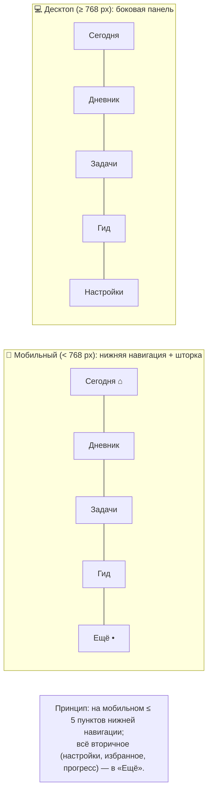

# 05. UX-проектирование: wireframes (low-fidelity)

> Low-fi схемы экранов. Цель — договориться о структуре и навигации до отрисовки UI.
> Условные обозначения: `[ ]` кнопка, `( )` поле ввода, `▢` чекбокс, `•••` меню, `≡` бургер, `⌂` навигация.

## 1. Навигационная модель



## 2. Мобильные экраны (320–767 px)

### W-01. Онбординг (3 шага)

```
┌─────────────────────┐
│  ◐ ◐ ○         Пропустить │   ← индикатор шагов
│                     │
│      (иллюстрация:   │
│       колонна/стоа)  │
│                     │
│   Утро. Намерение.  │
│   Вечер. Разбор.    │   ← заголовок шага
│                     │
│   Один ритуал —     │
│   план, дела и      │
│   дневник вместе.   │
│                     │
│  ┌───────────────┐  │
│  │    Далее →    │  │
│  └───────────────┘  │
└─────────────────────┘
```

### W-02. «Сегодня» — утро (главный экран)

```
┌─────────────────────┐
│  Стоя          ⚙ ≡  │   ← логотип, настройки, меню
│  Пятница, 14 августа│
├─────────────────────┤
│  ☀ Доброе утро, N   │
│                     │
│ ┌─────────────────┐ │
│ │ ❝Цитата дня❞    │ │   ← карточка цитаты
│ │ Марк Аврелий    │ │
│ │  [🔖] [↻]       │ │
│ └─────────────────┘ │
│                     │
│  Намерение дня      │
│  (Напишите, ради    │
│   чего этот день…)  │
│                     │
│  Препятствия        │
│  (Что может         │
│   помешать? Как     │
│   отвечу?)          │
│                     │
│  Главные задачи:    │
│  ▢ Задача 1         │
│  ▢ Задача 2         │
│  ▢ Задача 3   [+ ]  │
│                     │
│  [ Завершить утро ✓]│
├─────────────────────┤
│ ⌂Сегодня 📖Дневник ✅Задачи 🏺Гид •Ещё│
└─────────────────────┘
```

### W-03. «Сегодня» — вечер

```
┌─────────────────────┐
│  Стоя            ⚙  │
│  Пятница, 14 августа│
├─────────────────────┤
│  🌙 Вечерний разбор  │
│                     │
│  Что удалось? (…)   │
│  Что было вне       │
│  контроля? (…)      │
│  Чему научился? (…) │
│  Благодарность (…)  │
│                     │
│ ┌─────────────────┐ │
│ │ Итоги дня (авто):│ │
│ │ ✅ 4 из 5 задач  │ │
│ │ 1 — вне контроля │ │
│ └─────────────────┘ │
│                     │
│  [ Сохранить разбор ]│
├─────────────────────┤
│ ⌂Сегодня 📖Дневник ✅Задачи 🏺Гид •Ещё│
└─────────────────────┘
```

### W-04. Дневник — лента

```
┌─────────────────────┐
│  Дневник         🔍  │
│  ◀ Август 2026 ▶    │
├─────────────────────┤
│ ┌─────────────────┐ │
│ │ 14 авг · 🌗 · ☀   │ │  ← тип, настроение
│ │ Намерение дня: … │ │
│ │ Текст записи…    │ │
│ │ #работа #фокус   │ │
│ └─────────────────┘ │
│ ┌─────────────────┐ │
│ │ 13 авг · 🌕 · 🏺 │ │
│ │ Практика: Ди-    │ │
│ │ хотомия контроля │ │
│ └─────────────────┘ │
│ ┌─────────────────┐ │
│ │ 12 авг · 🌘 · 🌙 │ │
│ │ Вечерний разбор… │ │
│ └─────────────────┘ │
│                     │
│      [ ⊕ ]          │   ← плавающая кнопка
├─────────────────────┤
│ ⌂Сегодня 📖Дневник ✅Задачи 🏺Гид •Ещё│
└─────────────────────┘
```

### W-05. Редактор записи

```
┌─────────────────────┐
│  ←  Новая запись  💾 │
├─────────────────────┤
│  Тип: ☀утро 🌙вечер   │
│       ✍свободная 🏺  │
│                     │
│  [ ✨ Дайте промпт ] │
│                     │
│  (Текст записи…)    │
│                     │
│                     │
│                     │
├─────────────────────┤
│  Настроение: 😞😐🙂😄 │
│  Теги: #метка +     │
│  [ Автосохранение ✓ ]│
└─────────────────────┘
```

### W-06. Задачи — список и канбан

```
┌─────────────────────┐
│  Задачи   [список|доска] │
│  Фильтр: [сегодня ▾]     │
├─────────────────────┤
│ ┌─────────────────┐ │
│ │ ▢ Написать отчёт │ │
│ │   P1 · сегодня  │ │
│ │   ⭕ в моей власти│ │
│ └─────────────────┘ │
│ ┌─────────────────┐ │
│ │ ▢ Ответ партнёра │ │
│ │   P2            │ │
│ │   ◌ вне власти   │ │
│ └─────────────────┘ │
│ ┌─────────────────┐ │
│ │ ▣ Спортзал 30 мин│ │
│ │   done ✓        │ │
│ └─────────────────┘ │
│                     │
│      [ ⊕ ]          │
├─────────────────────┤
│ ⌂Сегодня 📖Дневник ✅Задачи 🏺Гид •Ещё│
└─────────────────────┘
```

### W-07. Создание задачи

```
┌─────────────────────┐
│  ←  Новая задача  💾 │
├─────────────────────┤
│  (Название задачи)   │
│  (Заметка…)          │
│                     │
│  Приоритет: P1 P2 P3 │
│  Срок: [14 авг ▾]    │
│  Повтор: [нет ▾]     │
│                     │
│  Дихотомия контроля: │
│  (•) ⭕ В моей власти │
│  ( ) ◌ Вне моей      │
│      власти          │
│  (Как отвечу? …)     │
└─────────────────────┘
```

### W-08. Гид — каталог практик и карточка

```
┌─────────────────────┐          ┌─────────────────────┐
│  Гид                 │          │  ←  Дихотомия       │
│  Категории: [Все ▾]  │          │      контроля       │
├─────────────────────┤          ├─────────────────────┤
│ ┌─────────────────┐ │          │ 🏺 Принятие · 5 мин  │
│ │ Дихотомия       │ │          │                     │
│ │ контроля · 5 мин│ │          │ Зачем: …            │
│ └─────────────────┘ │          │                     │
│ ┌─────────────────┐ │          │ Шаг 1: …            │
│ │ Негативная      │ │          │ Шаг 2: …            │
│ │ визуализация 10м│ │          │ Шаг 3: …            │
│ └─────────────────┘ │          │                     │
│ ┌─────────────────┐ │          │ [ Выполнить → ]     │
│ │ Memento mori    │ │          │ [🔖 В избранное]     │
│ └─────────────────┘ │          └─────────────────────┘
```

### W-09. «Ещё» — прогресс, избранное, настройки

```
┌─────────────────────┐
│  Ещё          ⚙     │
├─────────────────────┤
│ ┌─────────────────┐ │
│ │ 🔥 Стрик: 7 дней │ │
│ │ (мягко, без вины)│ │
│ └─────────────────┘ │
│  Неделя: 📖5 ✅12   │
│          🏺2  🙂4.2 │
│                     │
│  — Список —         │
│  📊 Прогресс        │
│  ⭐ Избранные цитаты │
│  🌐 Язык: RU / EN   │
│  🎨 Тема: 💡/🌙/⚙   │
│  ⏰ Напоминания      │
│  ⬇️ Экспорт данных   │
│  🗑 Удалить аккаунт  │
└─────────────────────┘
```

## 3. Десктоп-раскладка (≥ 768 px)

```
┌──────────┬────────────────────────────────┐
│  Стоя    │  Пятница, 14 августа    ⚙      │
│          ├────────────────────────────────┤
│ ──────── │  ☀ Доброе утро, Артём           │
│ Сегодня  │                                │
│ Дневник  │  ┌───────────┐  ┌────────────┐ │
│ Задачи   │  │ ❝Цитата   │  │ Намерение  │ │
│ Гид      │  │   дня❞    │  │ дня (…)    │ │
│ Прогресс │  └───────────┘  └────────────┘ │
│ ──────── │  ┌──────────────────────────┐  │
│ Настройки│  │ Главные задачи дня       │  │
│          │  │ ▢ …  ▢ …  ▢ …           │  │
│ 🌐 RU/EN │  └──────────────────────────┘  │
│ 🎨 Тема  │  [ Завершить утро ✓ ]          │
└──────────┴────────────────────────────────┘
```

**Правила адаптива:**
- < 768 px — нижняя навигация, один столбец, крупные тап-таргеты (≥ 44 px);
- ≥ 768 px — боковая панель, контент в 2–3 колонки, максимальная ширина контента ~720 px;
- ≥ 1280 px — широкие раскладки (канбан, дневник с боковой колонкой фильтров).

## 4. Принципы UX (до UI-этапа)

1. **Минимум входа:** каждый экран решает одну задачу; вход в «Сегодня» — не дольше 2 тапов.
2. **Низкий порог письма:** «Дайте промпт» и короткие поля вместо пустого листа.
3. **Одна главная кнопка на экран** — оранжевая/бронзовая, остальное вторично.
4. **Мягкость:** никаких красных «вы провалились»; пропуски не наказываются.
5. **Приватность видна:** индикатор 🔒 на дневнике, заметная строка «данные видны только вам».
6. **Всё обратимо:** редактирование/удаление/экспорт — из любого состояния можно выйти без потерь.
