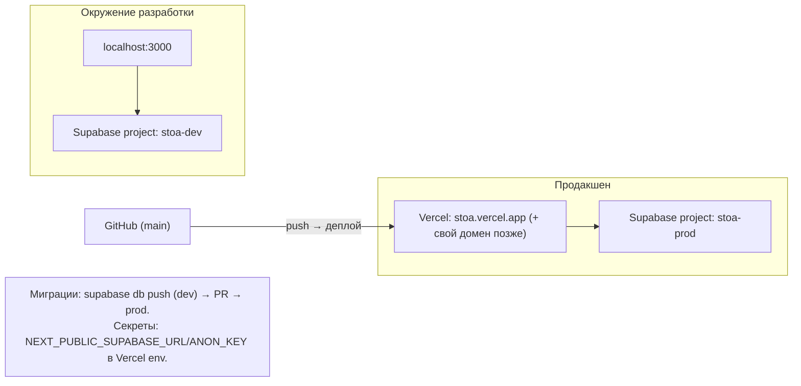

# 07. Выбор бэкенда: локально vs сервер/облако

## 1. Исходные ограничения

- Синхронизация телефон ↔ ноутбук обязательна (решение из брифа) → **чисто локальное хранение исключено**;
- Бюджет $0 → нужен бесплатный тир, который не «выключится» при первом же использовании;
- Дневник — чувствительные данные → нужна надёжная модель доступа (владелец и только владелец);
- Проект портфолио → стек должен быть современным и узнаваемым для работодателей.

## 2. Сравнение вариантов

| Критерий | **A. Supabase Free** | B. Firebase Spark | C. Neon (Postgres) + отдельный auth | D. Самохостинг (PocketBase и т.п.) |
|---|---|---|---|---|
| База данных | Postgres 500 МБ | Firestore 1 ГБ (NoSQL) | Postgres 512 МБ (зависит от плана) | любая, но нужен сервер |
| Auth | ✅ 50 000 MAU бесплатно | ✅ бесплатно без лимита MAU | ❌ нет — нужен Clerk/NextAuth и свой код | ❌ свой код + хостинг |
| Безопасность доступа | ✅ RLS на уровне БД | правила Firestore | ❌ RLS нет, всё через свой API | ❌ всё вручную |
| Файлы (фаза 2) | ~1 ГБ | 5 ГБ | ❌ | зависит от сервера |
| Realtime | ✅ (200 соединений) | ✅ (100) | ❌ | вручную |
| Бесплатно навсегда | ⚠️ да, но пауза после 7 дней простоя | ✅ | ⚠️ тарифы меняются | ⚠️ нужен бесплатный хост |
| Open Source | ✅ | ❌ | частично | ✅ |
| Портфолио-ценность | Высокая (SQL, RLS, модный стек) | Средняя | Средняя | Средняя |
| Сложность | Низкая (BaaS) | Низкая | Высокая (собирать auth+API самому) | Высокая (администрирование) |

Факты о бесплатном тире Supabase: БД 500 МБ, 50 000 MAU в Auth, ~1 ГБ файлового хранилища, 5 ГБ egress, до 2 активных проектов; проекты «засыпают» после недели неактивности и восстанавливаются вручную [1](https://makerkit.dev/blog/saas/supabase-pricing), [2](https://uibakery.io/blog/supabase-pricing).

## 3. Решение: **Supabase (бесплатный тир) + Vercel (бесплатный) — $0/мес**

**Почему:**
1. **Полный стек за $0**: Postgres + Auth (email/OAuth, подтверждение почты) + RLS + Storage + Realtime — именно то, что нужно нашим модулям, без сборки собственного сервера.
2. **RLS — правильный ответ на приватность дневника**: правило `user_id = auth.uid()` живёт в самой БД, поэтому «чужие записи» невозможны архитектурно, а не «по договорённости в коде». Это сильный пункт и для портфолио.
3. **SQL и Postgres** — обучающая ценность и классическая реляционная модель (ER-схема в [03-architecture.md](03-architecture.md)).
4. **Путь роста без переписывания**: при переходе на платный тир меняется только тариф, не код.
5. Firebase отпал по двум причинам: NoSQL-модель хуже подходит для дневника/задач со связями, а vendor-lock-in и отсутствие open source снижают портфолио-ценность. Neon+Clerk — больше собственной работы (auth-флоу, безопасность) без выигрыша для MVP. Самохостинг — администрирование съедает время учебного проекта.

## 4. Управление рисками бесплатного тира

| Риск | Митигация |
|---|---|
| Проект «засыпает» после 7 дней неактивности | Cron-запрос (GitHub Actions) раз в 3 дня держит проект тёплым; инструкция восстановления в README |
| Нет бэкапов на Free | Скрипт `npm run backup`: выгрузка данных через API в архив, запуск по расписанию |
| Лимит 500 МБ БД | Мониторинг размера; для портфолио-проекта запас огромен (тысячи записей — это копейки) |
| Egress 5 ГБ/мес | Кэширование цитат/практик на клиенте, статика — на CDN Vercel |

## 5. Схема окружений

## 6. Архитектура доступа к данным (итог)

- **Клиент → Supabase напрямую** (supabase-js + RLS): записи, задачи, логи дня, избранное — только свои строки.
- **Route Handlers (сервер) → Supabase (service role)**: ротация цитат, недельная сводка, экспорт, каскадное удаление аккаунта — операции, где серверу нужны повышенные права, а результат возвращается только владельцу.
- **Публичные данные**: `quotes`, `practices` — чтение для всех авторизованных, запись только из seed-скриптов.

Полные схемы потоков, ER-модель и RLS-политики — в [03-architecture.md](03-architecture.md).
