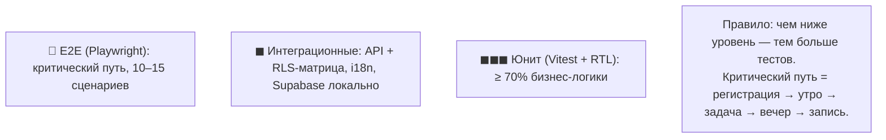

# 08. Тест-кейсы и критерии приёмки

## 1. Стратегия тестирования (пирамида)

## 2. Юнит-тесты (выборка ключевых)

**Реализовано:** `web/tests/` — 19 тестов (vitest), зелёные. Покрыты: ротация цитат (UT-01), статусы задач (UT-02), повторы и «как отвечу» (UT-04), «подкатка» сроков (FR-K4), мягкий стрик (UT-09), контент RU/EN.

| ID | Модуль | Тест-кейс | Ожидаемый результат | Приоритет |
|---|---|---|---|---|
| UT-01 | today | Выбор цитаты дня по дате | Детерминированно; нет повторов в пределах 30 дней | M |
| UT-02 | tasks | Переход статусов по диаграмме состояний | `done → todo` разрешён; архив только из `done` | M |
| UT-03 | tasks | Валидация задачи: пустое название | Ошибка «Введите название», задача не сохраняется | M |
| UT-04 | tasks | Задача «вне моей власти» | Поле «как отвечу» необязательно, но сохраняется, если заполнено | M |
| UT-05 | journal | Автосохранение черновика | Черновик пишется каждые 15 с изменённого текста | M |
| UT-06 | journal | Валидация настроения | Принимаются только значения 1–5 | M |
| UT-07 | guide | Завершение практики | Создаётся `practice_logs` + запись типа `practice` | M |
| UT-08 | i18n | Полнота словарей RU/EN | 0 отсутствующих ключей (линтер) | M |
| UT-09 | progress | Стрик с пропуском | Пропуск обнуляет серию, но без «штрафного» сообщения | M |
| UT-10 | export | Экспорт данных | JSON/Markdown содержат все записи и задачи, валидны | S |

## 3. Интеграционные тесты

| ID | Тест-кейс | Ожидаемый результат |
|---|---|---|
| IT-01 | RLS-матрица: пользователь A читает записи B | Пустой результат (403), данные не утекают |
| IT-02 | RLS-матрица: анонимный пользователь | Ничего не видит ни в одной приватной таблице |
| IT-03 | Auth: регистрация → подтверждение email → сессия | Сессия активна, профиль создан |
| IT-04 | Realtime: изменение статуса задачи на устройстве 1 | Устройство 2 получает обновление ≤ 2 с |
| IT-05 | Экспорт при 1000 записях | Выполняется ≤ 30 с, архив полон |
| IT-06 | Удаление аккаунта | Каскадно удалены все строки пользователя во всех таблицах |

## 4. E2E-сценарии (Playwright)

**Реализовано:** `web/e2e/critical-path.spec.ts` — E2E-01, E2E-04, E2E-05, E2E-06; конфиг `web/playwright.config.ts` (desktop + mobile-проекты). Запуск: `npm run test:e2e`. В песочнице без браузеров прогон недоступен, поэтому тесты исполняются автоматически в **CI (GitHub Actions, `.github/workflows/ci.yml`)**: юнит → сборка → E2E на каждом push/PR.

| ID | Сценарий | Шаги (кратко) | Критерий успеха |
|---|---|---|---|
| E2E-01 | Критический путь нового пользователя | Регистрация → подтверждение → онбординг → утро (намерение + задача) → задача в done → вечер (4 вопроса) → сохранение | Все шаги без ошибок; в дневнике 2 записи (утро/вечер); стрик = 1 |
| E2E-02 | Синхронизация между «устройствами» | Два браузерных контекста, один аккаунт; задача создана в первом | Появляется во втором ≤ 2 с |
| E2E-03 | Пропуск дня | Пропустить утренний ритуал; вернуться назавтра | Приветствие без упрёков, стрик сброшен, но счётчик «всего дней» растёт |
| E2E-04 | Язык на лету | Переключить RU → EN на экране «Сегодня» | Весь интерфейс и цитата переключены мгновенно, URL сменил локаль |
| E2E-05 | Тема | Сменить тему на тёмную | Токены применены, переживают перезагрузку |
| E2E-06 | Практика → дневник | «Дихотомия контроля» → выполнить → наблюдения | В дневнике запись типа «практика» с привязкой |
| E2E-07 | Удаление записи | Удалить запись с подтверждением | Запись исчезла из ленты и из БД |
| E2E-08 | Восстановление пароля | «Забыли пароль» → письмо → новый пароль → вход | Вход с новым паролем успешен |

## 5. Критерии приёмки (acceptance criteria) по ключевым фичам

### AC-1. Утренний ритуал (US-06/07/08)
- **Given** авторизованный пользователь на экране «Сегодня» утром, **When** заполняет намерение и завершает утро, **Then** в `day_logs` создана строка с `morning_done=true`, выбранные задачи привязаны к дате, стрик обновлён.
- **And** при повторном заходе днём блок «Утро» показан как завершённый и доступен для просмотра, но не для дублирования.

### AC-2. Вечерний разбор (US-09/10)
- **Given** завершённое утро и задачи дня, **When** пользователь сохраняет вечерний разбор, **Then** создана запись типа `evening` со всеми ответами; автоитоги показывают реальное соотношение выполненных задач.
- **And** обязательные поля — только «Что удалось?» (минимальный порог входа).

### AC-3. Метка контроля (US-19)
- **Given** задача «вне моей власти», **When** она отображается в списке и в вечерних итогах, **Then** помечена символом ◌ цвета терракоты, **And** не считается «провалом» в статистике выполнения.

### AC-4. Приватность дневника (US-17)
- **Given** два разных аккаунта, **When** пользователь A пытается прочитать данные B любым способом (UI, API), **Then** получает пустой результат; **And** в интерфейсе дневника виден индикатор 🔒 «только вы».

### AC-5. Мягкий стрик (US-11/29)
- **Given** стрик 7 дней и пропуск одного дня, **When** пользователь возвращается, **Then** он видит «дней всего» и спокойный текст поддержки, **And** нигде нет штрафов, блокировок или красных предупреждений.

### AC-6. i18n (US-31)
- **Given** приложение на русском, **When** пользователь выбирает English, **Then** 100% видимых строк и весь контент (цитаты, практики, промпты) переключены мгновенно, **And** выбор сохранён в профиле и применяется при входе с другого устройства.

### AC-7. Экспорт (US-34)
- **Given** аккаунт с данными, **When** пользователь запускает экспорт, **Then** скачивается архив с JSON и Markdown, содержащий все записи, задачи, логи и избранное, **And** файлы открываются стандартными средствами.

### AC-8. Удаление аккаунта (US-35)
- **Given** аккаунт с данными, **When** пользователь подтверждает удаление (ввод email), **Then** все его данные удалены каскадно, сессия завершена, **And** восстановление невозможно (уведомление об этом до удаления).

## 6. Нефункциональные проверки

| Проверка | Метод | Порог |
|---|---|---|
| Производительность | Lighthouse (mobile, 4G) | Perf/A11y/Best Practices ≥ 90 |
| Доступность | axe-core + ручной прогон с клавиатурой | 0 critical issues; WCAG 2.1 AA |
| Кроссбраузерность | Chrome, Safari, Firefox (последние 2 версии) | критический путь без дефектов |
| Адаптивность | 320 / 390 / 768 / 1024 / 1440 / 1920 px | нет горизонтального скролла, тап-таргеты ≥ 44 px |
| Безопасность | RLS-матрица (IT-01/02), проверка заголовков, env-секреты | чужие данные недоступны; секреты только в env |
| i18n | линтер ключей + визуальный прогон обеих локалей | 0 пропущенных ключей |

## 7. Definition of Done (для задачи в спринте)

1. Код + юнит/интеграционные тесты проходят локально и в CI.
2. Строки локализованы (RU+EN), линтер i18n чист.
3. Экраны проверены на 390 и 1440 px, обе темы.
4. E2E-сценарий (если затрагивает критический путь) обновлён и зелёный.
5. Изменение соответствует ТЗ и задокументировано при необходимости.
